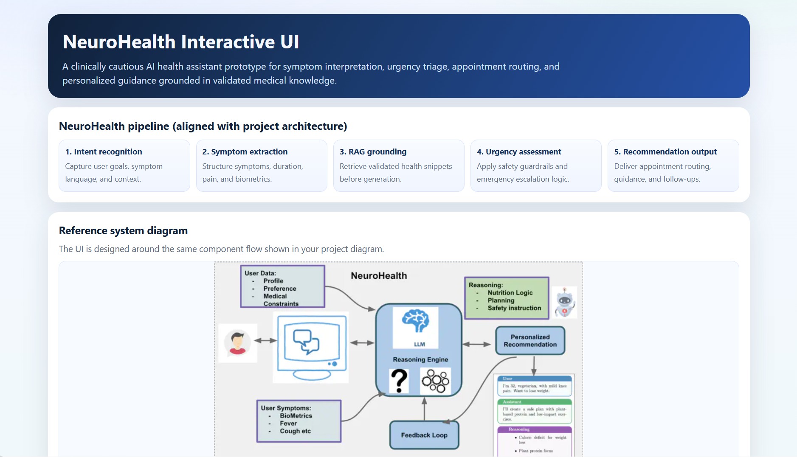
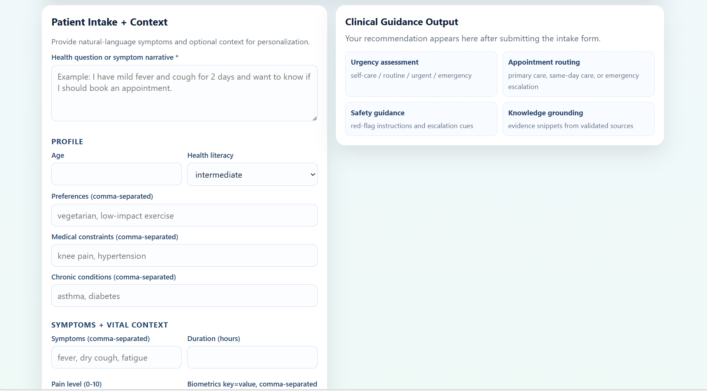

# NeuroHealth Prototype (GSoC 2026 Proposal)

This repository contains a working prototype for **NeuroHealth: AI-Powered Health Assistant**, aligned with the provided project description and architecture diagram.

## What is implemented

The prototype includes the core end-to-end pipeline:

1. **Structured user context intake**
   - User profile: age, preferences, chronic conditions, medical constraints.
   - Symptom report: symptoms, pain level, duration, biometrics.

2. **Reasoning engine**
   - **LLM provider: Gemini** via Google Generative Language API.
   - Prompting includes nutrition logic, planning guidance, and safety instructions.
   - Multi-turn history support is built into request handling.

3. **RAG-style grounding**
   - **Embedding provider: GitHub Models** (`openai/text-embedding-3-small` by default).
   - Knowledge chunks are embedded and retrieved using cosine similarity.
   - Retrieved validated snippets are injected into Gemini prompts.

4. **Safety and urgency guardrails**
   - Emergency red-flag detection (e.g., chest pain + shortness of breath).
   - Urgency classification + appointment routing.
   - Emergency path bypasses LLM generation and escalates immediately.

5. **Personalized recommendation output**
   - Assistant response.
   - Urgency label.
   - Appointment recommendation.
   - Safety instructions.
   - Clarifying questions.
   - Knowledge sources used.

6. **Feedback loop**
   - Captures rating/comments into JSONL for iterative tuning.

## Project structure

```text
neurohealth/
  config.py         # env/config loading
  models.py         # core data models
  embeddings.py     # GitHub Models embeddings client
  llm.py            # Gemini generation client
  kb.py             # knowledge ingestion/retrieval
  safety.py         # urgency/safety logic
  prompts.py        # prompt builders
  runtime.py        # shared parsing + engine wiring
  engine.py         # orchestration layer
  feedback.py       # feedback persistence
  cli.py            # interactive + one-shot CLI
  ui.py             # interactive web UI
data/
  knowledge_base.json
tests/
  test_safety.py
  test_kb.py
  test_engine.py
  test_runtime.py
```

## Setup

1. Use Python 3.11+.
2. Set environment variables:

```bash
export GEMINI_API_KEY="your_gemini_key"
export GITHUB_TOKEN="your_github_token"
```

`Settings.from_env()` also auto-loads values from a local `.env` file in the current working directory.

Optional overrides:

```bash
export GEMINI_MODEL="gemini-2.0-flash"
export GITHUB_EMBEDDING_MODEL="openai/text-embedding-3-small"
export GITHUB_MODELS_EMBEDDING_ENDPOINT="https://models.github.ai/inference/embeddings"
export NEUROHEALTH_KB_PATH="data/knowledge_base.json"
export NEUROHEALTH_FEEDBACK_PATH="data/feedback.jsonl"
```

## Usage

### One-shot recommendation

```bash
python -m neurohealth.cli \
  --query "I am 32, vegetarian, with mild knee pain and mild fever. What should I do?" \
  --age 32 \
  --preferences vegetarian \
  --medical-constraints "mild knee pain" \
  --symptoms "mild fever,knee pain" \
  --pain-level 3 \
  --biometric temperature_c=37.9
```

### Interactive mode

```bash
python -m neurohealth.cli --interactive --age 32 --preferences vegetarian
```

### Interactive web UI

```bash
python -m neurohealth.ui --host 127.0.0.1 --port 8000
```

Then open `http://127.0.0.1:8000` in your browser.
The UI starts even if credentials are not exported; on submit it will show a clear in-page error if keys/quota are invalid.
The redesigned UI includes an architecture pipeline view, embedded project diagram, richer intake workflow, and a conversational recommendation panel.

### UI screenshots




### Run tests

```bash
python -m unittest discover -s tests -v
```

## Important safety note

This prototype is for research/proposal demonstration only and **does not replace clinical care**. It includes basic guardrails, but real-world deployment would require medical governance, expanded validation, and clinical oversight.
